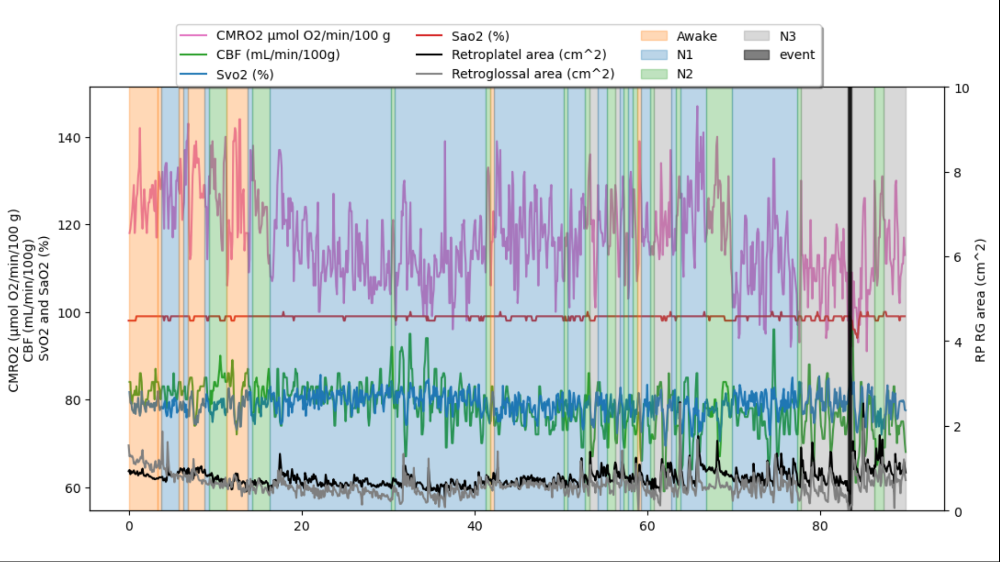
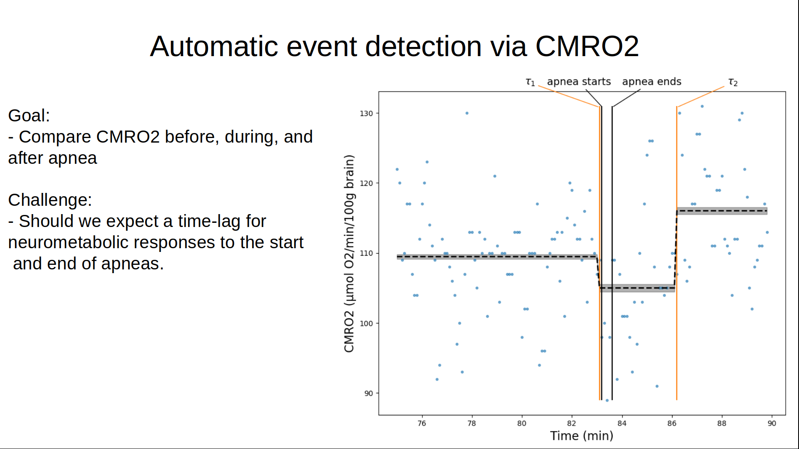

======
 Problem:
======

We have 90 minutes of metabolic data from a sleeping patient with obstructive sleep apnea. Due to simultanious eeg and airway pressure recordings we have information about the patients sleep status (Awake, Stage 1, Stage 2, or Stage 3 of sleep) and breathing events (apneas and hypopneas). We want to measure how much if any oxygen metabolism changes in the brain (CMRO2) in response to an apneac event.

Here you can see that over the the whole 90 minutes the patient has one apnea lasting approximatley 90 seconds. However, we don't know if there will be a resulting change in CMRO2, whether there will be a delay between the start of the apnea and a change in CMRO2, or if there will be a delay for CMRO2 to rise after the event ends. To explore this we zoom into the approximatly 15 minutes surrounding the apneaic event and implement a double switch-point analysis.

We model CMRO2 overtime with a Normal distrubition whose mean is dependent upon two switch points. The switchpoints are uniformally distributed between either the first time point or the first switch point and the end of the time series. There are three modeled means one prior to the first switchpoint, the second in between the two switchpoints, and the third after tthe second switchpoint. We then use MCMC fo inference.

The apnea is not explicitly modeled, yet we can see that as soon as the apnea starts CMRO2 decreases right away (from 109.4 to 104.1 micromoles of O2/minute/100g of tissue) but doesn't rebound until about 2 minutes after the end of the apnea.

------
