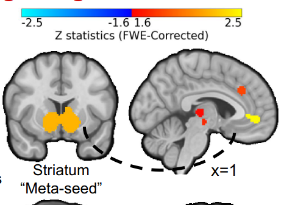

Connectivity between the  striatum and prefrontal cortex (PFC), key hubs of reward processing (Bartra, 2013), has been probed during a wide array of reward tasks. (Camara, 2008; Smith, 2014; McCormick,2017). However, it remains unclear whether these studies reveal consistent and specific patterns of connectivity.To address this problem, we conducted a meta-analysis of psycho-physiological interactions (PPI) (Friston,1997) for reward-dependent corticostriatal connectivity.

We used NiMARE (RRID:SCR_017398) to conduct a coordinate-based meta-analysis of studies examining reward-dependent corticostriatal connectivity. Studies were identified, assessed for inclusion, and organized based on seed and reward task.

We identified consistent patterns of reward-dependent connectivity supporting supporting previous studies implicating this circuit.vHowever, connectivity showed relative changes in response to phase of reward, possibly to better support different functions.

