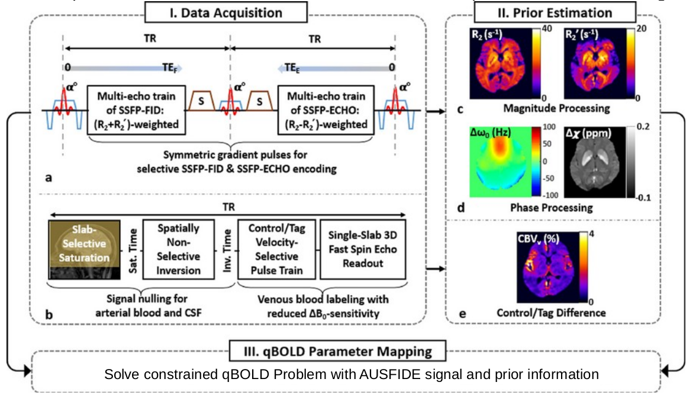
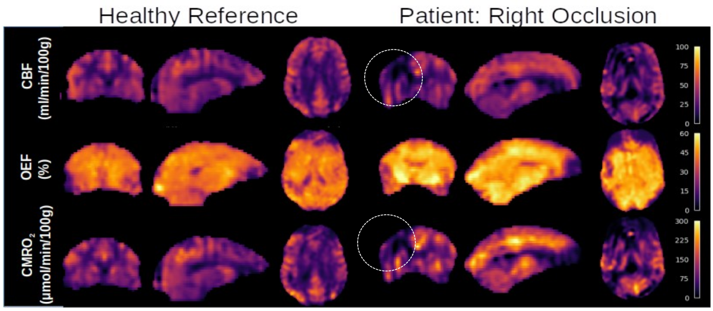
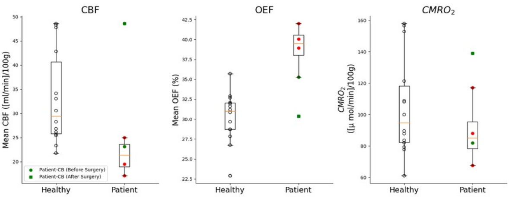
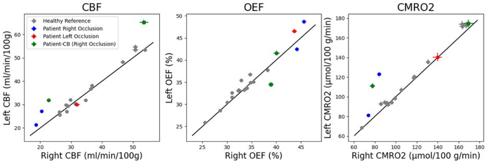

3D Quantitative BOLD MRI in Patients with Unilateral Carotid Occlusion
======

Motivation
-------------------------

 Recently developed constrained quantitative BOLD (c-qBOLD) offers the ability to quantify local cerebral metabolic rate of oxygen (CMRO2). However, it has yet to be applied in a clinical setting. Goals: By imaging patients with carotid occlusions we expect to observe specific disruptions to cerebral blood flow (CBF) and oxygen extraction fraction (OEF). Approach: Patients (N=4) presenting with unilateral carotid occlusions were examined with a 3D constrained qBOLD protocol to map CBF, OEF, and cerebral blood volume, allowing for calculation of regional CMRO2. Results: Data show both global and hemispheric dysfunction in oxygen metabolism compared to healthy subjects.
 
Impact
------------------------
The novel c-qBOLD protocol has potential clinical utility as  the degree and character of metabolic dysfunction, but can be performed quickly, yielding 3D maps of CBF, OEF and CMRO2.

Introduction
-------------------------

	Healthy brain function relies on a continuous supply of oxygen whose consumption is determined by both the supply of oxygen to the brain and degree of oxygen extracted from blood1. Recent advances in MRI techniques have allowed for delineating these processes which previously required PET or other uncomfortable calibration procedures2. Lee and Wehrli3 recently developed a “constrained qBOLD+QSM” (c-qBOLD) approach that enables voxelwise 3D imaging of the brain’s oxygen metabolism without dual-gas calibration. The approach is similar to that by Cho et al4. Here, we first apply the method to select patients with neurovascular-metabolic disease.
	
	
Methods
-------------------------

	To demonstrate clinical utility of c-qBOLD, patients with unilateral carotid occlusions were recruited from the Neurology practice in the authors’ institution. Patients were imaged with the 3D c-qBOLD protocol consisting of three sequences, VS-VSL (yielding venous blood volume)3, AUSFIDE 3 (for R2’ and R2 mapping) 3 and pCASL (for CBF). Lastly, an MP-RAGE is included to register qBOLD images to neural tissue. The Table below lists patient demographics and diagnosis.

	The AUSFIDE sequence utilizes alternating steady-state-free-precession (SSFP) FID and ECHO encoding and samples multiple echoes in 3D.  Imaging parameters used in AUSFIDE were: FOV=240×240×120mm3, reconstruction matrix=160×160×40, number of radial views=144, echo spacing=1.5ms, number of echoes=17 (nine regularly encoded+eight z-shimmed). VS-VSL parameters were: FOV=220×220×180mm3 (sagittal orientation), reconstruction matrix=72×72×60, TR=3 seconds, saturation time=1.6 seconds, inversion time=1.14 seconds, cut-off velocity=7.5mm/s in the VS pulse train, echo train length=40 and echo spacing=2.5ms in the fast SE readout, and k-space subsampling factor=3.3.
Prior Constrained qBOLD processing via AUSFIDE: First, venous blood volume (CBVv) maps were obtained using the VS-VSL data. Next, six parameter maps including magnetic susceptibility, R2’ and R2 (RF reversible and RF irreversible transverse relaxation) were reconstructed from the AUSFIDE images. These parameter maps were used to fit to the c-qBOLD model3 yielding voxel-wise values of CBF, OEF, and CMRO2. Details are described in ref. 3.             
Data analysis: Brain tissue segmentation was performed on the MP-RAGE using FreeSurfer5 to create masks for cortical gray and white matter. The masks were then coregistered to the first echo of the SSFP-FID images facilitating the extraction of CFB, OEF, and CMRO2 from gray and white matter but excluding non-neural tissue. We compare patient values to data from healthy participants5.

Results
-------------------------

	Parametric maps (Figure 1) of CBF, OEF, and CMRO2 qualitatively suggest global as well as spatially specific differences in overall brain oxygen metabolism as occlusion patients have noticeably lower CBF and CMRO2 on the (ipsilateral) side of the brain. 

In quantifying differences in oxygen metabolism across the entire brain (Figure 2) we find CBF to be significantly lower in the patients (mean=26.6 ml/min.100g) as compared to healthy participants (N=14, mean=45.5 ml/min.100g) previously scanned with this technique5 (p=0.005) as well as CMRO2 (110 versus 153μmol/100g/min), p=0.036. Particularly notable, however, is the difference in global oxygen extraction fraction in the patients (mean OEF=47.3 %) as compared to our reference group (OEF=36.6 %), p<0.001.

Taking advantage of the 3D properties of our image we then examine the data by hemisphere (Figure 3). Occlusion patients seem to experience both a fixed effects across hemispheres relative to reference subjects, as well as interactions depending on the side of the occluded vessel (e.g. a patient with right-sided occlusion experiences lower CBF but more so on the ipsilateral side of the brain). However, a greater number of study subjects is needed to support this observation. 

Discussion and Conclusion 
-------------------------
The 3D prior constrained qBOLD protocol allowed us to quantify measures of the brain’s oxygen metabolism in patients with carotid artery occlusive disease. Recent work conducted in the authors’ lab in healthy subjects with the same approach3 showed good agreement for CMRO2, OEF, and CBF with prior literature. Our method, though similar to Cho et al4 , independently measures venous blood volume, critical for estimating CMRO2. The present pilot study compares derived parameters in patients and healthy subjects finding (a) globally reduced CBF, increased OEF (a compensatory effect), and slightly reduced CMRO2, and b) ipsilarerally lower CBF and higher OEF relative to the contralateral side.  These early results, while encouraging, must be corroborated with larger patients samples.

Future work will follow patients post-intervention (drug treatment, stenting or etc) to address whether interventions restore interhemispheric symmetry and overall return of global vascular-metabolic parameters.  Additionally, while the current sequence shows promise, the processing strategy could be improved to reduce noise, possibly by using Bayesian estimations of the qBOLD parameters7. 

Refrences:
1.Watts, M. E., Pocock, R., & Claudianos, C. (2018). Brain energy and oxygen metabolism: emerging 	role in normal function and disease. Frontiers in molecular neuroscience, 11, 216.
2.Fan, A. P., An, H., Moradi, F., Rosenberg, J., Ishii, Y., Nariai, T., ... & Zaharchuk, G. (2020). 	Quantification of brain oxygen extraction and metabolism with [15O]-gas PET: A technical 	review in the era of PET/MRI. Neuroimage, 220, 117136.
3.Lee, H., & Wehrli, F. W. (2022). Whole-brain 3D mapping of oxygen metabolism using constrained 	quantitative BOLD. Neuroimage, 250, 118952.
4. Cho, J., Spincemaille, P., Nguyen, T. D., Gupta, A., & Wang, Y. (2021). Temporal clustering, tissue 	composition, and total variation for mapping oxygen extraction fraction using QSM and 	quantitative BOLD. Magnetic Resonance in Medicine, 86(5), 2635-2646.
5. Lee, H., Xu, J., Fernandez-Seara, M. A., & Wehrli, F. W. (2023). Validation of a New 3D 	Quantitative BOLD Based Cerebral Oxygen Extraction Mapping, JCBFM,
6.Reuter, M., Rosas, H.D., Fischl, B., 2010. Highly Accurate Inverse Consistent Registration: A Robust 	Approach. Neuroimage 53 (4), 1181–1196. http://reuter.mit.edu/papers/reuter-robreg10.pdf 
7. Cherukara, M. T., Stone, A. J., Chappell, M. A., & Blockley, N. P. (2019). Model-based Bayesian 	inference of brain oxygenation using quantitative BOLD. Neuroimage, 202, 116106.

